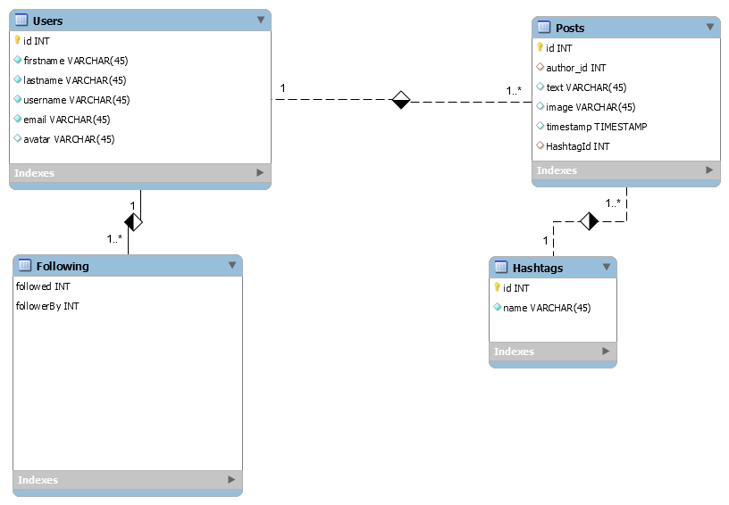

# Devs on Deck
 

#### anreeves83@gmail.com
#### ayanna.shaheed@gmail.com
#### DanielleRBeaty@gmail.com
#### domiwar.it@gmail.com

----
### Description
###### Our team created a social media app for developers to share content with other developers, UX desigers etc. The application can to create, save, and delete text and pictures within mySQL database. This application used an express backend, mySQL serever, passport and save and retrieve users' data from mySQL data. 

---
## Table of contents
* [Dependencies](#Dependencies)
* [How to Use](#how-to-Use)
* [Licenses](#Licenses)
* [Contributors](#Contributors)
* [App Scheme](#App-Fuctionality)
* [App Functionality](#App-Fuctionality)

---

### Dependencies
##### 

* [MySQL](https://www.npmjs.com/package/mysql) NPM package to connect to MySQL database and perform queries.

* [InquirerJs](https://www.npmjs.com/package/inquirer/v/0.2.3) NPM package to interact with the user via the command-line.

* [console.table](https://www.npmjs.com/package/console.table) to print MySQL rows to the console.

* [Passport](http://www.passportjs.org/docs/) Passport is authentication middleware for Node that can authenicate username and passwords. 

### How to Use
###### 
---
### Licenses
###### ISC
---
### Contributors
###### Aja Reeves
###### Ayanna Shaheed 
###### Danielle Beaty
###### Dominique Warfield 
---
### App Schema

---
### App Functionality